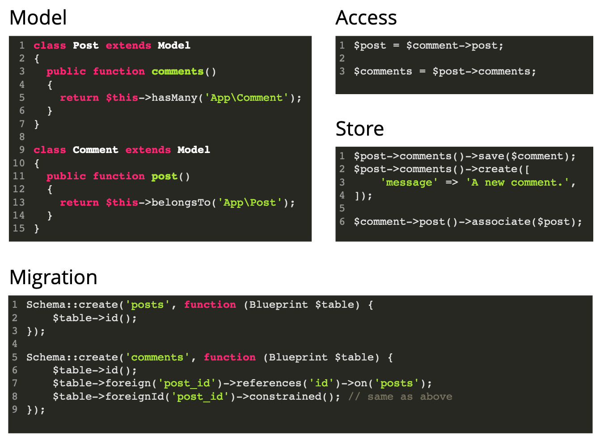
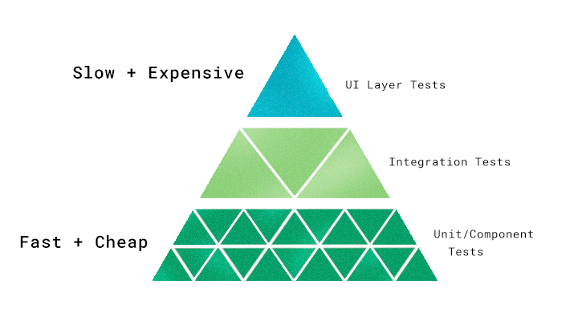

# Laravel
[Dokumentation](https://laravel.com/docs/7.x) lesen, macht gute Laravel-Entwickelnde!

## setting up the local development environment
### server:
- ([install](https://linuxize.com/post/how-to-install-virtualbox-on-ubuntu-18-04/#installing-virtualbox-from-ubuntu-repositories)) [VirtualBox](https://www.virtualbox.org/wiki/VirtualBox) as virtual machine
- ([install](https://linuxize.com/post/how-to-install-vagrant-on-ubuntu-18-04/#2-installing-vagrant)) [Vagrant](https://www.vagrantup.com/docs) as configuration of the virtual machine
- ([install](https://laravel.com/docs/7.x/homestead#first-steps)) [Homestead](https://laravel.com/docs/7.x/homestead) as pre-packaged Vagrant box providing everything Laravel needs
- [configure Homestead](https://laravel.com/docs/7.x/homestead#configuring-homestead):
  - folder mapping (`/Homestead/Homestead.yaml`)
  - domain mapping (`/Homestead/Homestead.yaml`)
  - hostname resolution (`/etc/hosts`)

### framework:
- ([install](https://laravel.com/docs/7.x#installing-laravel)) Laravel
- ([instal](https://laravel.com/docs/7.x/frontend#introduction)) Vue or Bootstrap

### debugging:
- [config](https://christattum.com/debugging-on-laravel-homestead-using-vscode/) XDebug

## file structure

```php
app/            # core code of your application
  Console/      # artisan commands (CLI)
  Exceptions/   # error handling
  Http/         # controllers, middleware, and requests
  Providers/    # prepare your application for incoming requests
bootstrap/      # bootstraps the framework (includes cache/), not to be confused with CSS
config/         # configuration files
database/       # db migrations, factories and seed
public/         # assets and index.php,
resources/      # uncompiled views, js, scss
routes/         # your routes go here
storage/        # files generated by Laravel e.g. logs, templates
tests/          # your tests go here
vendor/         # composer dependencies
```

## Code-Snippets zu
- [Routen](./resources/laravel-routes.php)

## Template Engine ([Blade](https://laravel.com/docs/7.x/blade))

- separation of Concerns: Trennen von Logik und Design
- Teamwork: Einfacher für nicht-Programmierer
- Productivity: Wiederverwendung von Templates
- Security: Kodieren von z.B. HTML-Zeichen

- immer mit `filename.blade.php`

```
@extends('layouts.app')//angeben wo es eingebunden wurde

@include('header') //einbinden anderer Dateien

@yield('content') //(weichen, Platz machen)

@section('content') //define a section

@endsection //define end of section

@show //define end of section and yield immediately

@if (count($records) === 1)
    I have one record!
@elseif (count($records) > 1)
    I have multiple records!
@else
    I don't have any records!
@endif

@for ($i = 0; $i < 10; $i++)
    The current value is {{ $i }}
@endfor

@foreach ($users as $user)
    <p>This is user {{ $user->id }}</p>
@endforeach
```

## MVC

## [Migrations](https://laravel.com/docs/7.x/migrations)

```
php artisan make:migration create_products_table
php artisan make:migration create_products_table --create=products

php artisan make:migration add_color_to_products_table --table=products
```

Beispiel für [Migration-Datei](./resources/laravel-migration.php)
```
php artisan migrate

php artisan migrate:rollback
php artisan migrate:rollback --step=5
php artisan migrate:reset

php artisan migrate:fresh
```


## [Model](https://laravel.com/docs/7.x/eloquent)

```
php artisan make:model Product

php artisan make:model Product -m
php artisan make:model Product --migration

php artisan make:model Product -c
php artisan make:model Product --controller

php artisan make:model Product -mc
```

Sammlung von [Methoden](./resources/laravel-modelmethods.php)

## [Seeder](https://laravel.com/docs/7.x/seeding)

```
php artisan make:seeder CategorySeeder
php artisan db:seed

```

## [Factories](https://laravel.com/docs/7.x/database-testing#writing-factories)
```
php artisan make:factory ProductFactory
```

Dokumentation der php-library [Faker](https://github.com/fzaninotto/Faker)


## CRUD mit Resource-Controller

CRUD

- Create, Read, Update, Delete
- gilt für die meisten Anwendungen
- es gibt in Laravel bereits einen vorgefertigten Controller, der diese Funktionen integriert: Resource-Controller

|CRUD| Verb      | URI                   | Action | Route Name |
|----|-----------|-----------------------|--------|------------|
|create| GET       | /photos/create        |	create |	photos.create |
|create| POST      | /photos               |	store |	photos.store |
|read| GET       | /photos               | index | photos.index |
|read| GET       | /photos/{photo}       |	show |	photos.show |
|update| GET       | /photos/{photo}/edit  |	edit |	photos.edit |
|update| PUT/PATCH | /photos/{photo}       |	update |	photos.update |
|delete| DELETE    | /photos/{photo}       |	destroy |	photos.destroy |

```
//create a resource controller with artisan

php artisan make:controller ProductController --resource
php artisan make:controller ProductController --resource --model=Product
```

```php
// how to address a resource controller in your route files
Route::resource('/admin/products', 'ProductController');
```

### only/except
Möglichkeit zu spezifizieren welche Methoden eines Resource-Controller auf ihre entsprechenden Routen gemappt werden sollen. Empfehlung: Nicht gemappte Methoden auch aus dem Resource-Controller löschen.

```php
use Illuminate\Support\Facades\Route;

Route::resource('/admin/products', 'ProductController')->only([
    'index', 'show'
]);

Route::resource('/admin/products', 'ProductController')->except([
    'create', 'store', 'update', 'destroy'
]);
```


`artisan route:list` zeigt alle angelegten Routen unseres Projekts an

## Validation

```php
// app/http/Controllers/Backend/ProductController.php

public function store(Request $request)
    {
        $validatedDate = $request->validate([
            'name' => ['required', 'min:3'], //eine mögliche Schreibweise
            'price' => 'required|numeric|between:0,9999.99', //eine andere
            'description' => 'required| min:3',
            'msrp' => 'numeric|between:0,9999.99',
            'stock' => 'integer'
        ]);
        /* so hätten wir alles einzeln angegeben

        $product = new Product();
        $product->name = $validatedDate['name'];
        $product->description = $validatedDate['description'];
        $product->price = $validatedDate['price'];
        $product->msrp = $validatedDate['msrp'];
        $product->stock = $validatedDate['stock'];
        $product->save();

        wird aber ersetzt durch:*/

        Product::create($validatedData);

        return redirect('admin/products');
    }
```

## [Route Grouping](https://laravel.com/docs/7.x/routing#route-group-middleware)

```php
// routes/web-backend.php
Route::prefix('admin')->name('admin.')->group(function () {
    //alle bisherigen Backend-Routen
}
```


## [Mass Assignment](https://laravel.com/docs/7.x/eloquent#mass-assignment)
Bei dem Error `Add [name] to fillable property to allow mass assignment on [App\Product]. ` müssen wir folgendes ergänzen:

```php
// app/Product.php
class Product extends Model
{
    protected $fillable = [
        'name',
        'price',
        'description',
        'msrp',
        'stock'
    ];
}
```

## Relationships

es gibt verschiedene Strukturen

- one to many



- many to many
  - `->belongsToMany` in den jeweiligen Models
  - extra table_migration für mapping
```php
Schema::create('user_role', function (Blueprint $table) {
  $table->foreignId('user_id')->constrained()->onDelete('cascade');
  $table->foreignId('role_id')->constrained()->onDelete('cascade');
});
```
-
  - anstatt `associate()`:
```php
$user->roles()->attach($role);
$user->roles()->sync($roles);
```
- polymorphic
- has (one/many) through

## Cookies
- HTTP selbst ist stateless, kein Zusammenhang zwischen einzelnen Anfragen
- Cookie ermöglichen diese Zusammenhänge herzustellen
- werden im HTTP als Anweisung gesendet, vom Browser angelegt

```php
// Cookies setzen
setcookie(
  $name,
  $value = "",
  $expires = 0,
  $path = "",
  $domain = "",
  $secure = FALSE,
  $httponly = FALSE
);
setcookie("TestCookie", "TestValue");

// Cookies auslesen
echo $_COOKIE["TestCookie"];
```

Cookies in [Laravel](https://laravel.com/docs/7.x/requests#cookies)

```php
// Cookies setzen
return response('Hello World')->cookie(
    'name', 'value', $minutes, $path, $domain,  $secure, $httpOnly
);

// Cookies auslesen
$value = $request->cookie('name');
```

## Session
- speichere Sachen auf dem Server und speicher auf dem Client nur eine Referenz auf die Daten (Cookie)

PHP
```php
// Session starten
// Sendet in der nächsten Antwort einen Set-Cookie-Header mit:
// Set-Cookie: PHPSESSID=sbhjejn125j2qvs981qu57d8ct; path=/
session_start();

// Werte setzen
$_SESSION["newsession"] = $value;

// Werte auslesen
// In der Anfrage war der Cookie-Header mit der SessionID des Nutzers:
// Cookie: PHPSESSID=sbhjejn125j2qvs981qu57d8ct
$value = $_SESSION["newsession"];
```

Laravel
```php
// Session-Werte setzen
session()->put('key', 'value');

// Session-Werte auslesen
$value = session()->get('key');

// Session-Inhalt prüfen
session()->has('key');

// Shorthand-Syntax und Default-Werte
session(['key' => 'value']);
$value = session('key');
$value = session('key', 'default');
$value = session('key', function () {
    return 'default';
});
```

## Middleware
- Code der irgendwo zwischengeschaltet wird
- request-response-cycles

[...]

## Dependency Injection
- Abhängigkeiten von anderen Klassen werden als Parameter an den Constructor der Klasse übergeben
- macht Testen einfacher
- bietet die Möglichkeit z. B. die Funktionalität eines Controllers in eine passende Klasse auszulagern, per Parameter einzubinden und dann direkte auf den Elementen aufzurufen

## Service Container
- sorgen dafür, dass Objekte bei dependency injection durch das Übergeben auch erstellt werden
- einfache Verbindungen werden von Laravel automatisch bereitgestellt (reflection)
- komplexe Bindings werden in eigenen Service Providern gesammelt
- neue ServiceProvider müssenn extra registriert werden unter config/app unter Application Providers

## Order By

## Error Pages
```
php artisan vendor:publish --tag=laravel-errors
```

Zeigt Laravels Error Page Templates. Dort anpassen entsprechender eigener Views. Damit unterschiedliche 404-Seiten für Front- und Backend angezeigt werden:

```php
// app/Exceptions/Handler.php

public function render($request, Throwable $exception)
{
    if ($this->isHttpException($exception)) {
        if ($exception->getStatusCode() == 404) {
            if ($request->is('admin/*')) {
                return response()->view('backend.errors.404', [], 404);
            }

            return response()->view('frontend.errors.404', [], 404);
        }
    }

    return parent::render($request, $exception);
}
```

## Testing



- **Unit Tests** testen nur einzelne Methoden
- **Integration/Feature Tests** testen eine Reihe von Methoden (z.B. ganze Controller)

Ausführen im Laravel-Verzeichnis
- `phpunit`
- `artisan test`
- läuft alle Tests durch, die im tests-Ordner liegen und auf .test enden

### Vorbereitung
.env.testing

```
APP_NAME=Laravel
APP_ENV=testing
APP_KEY=base64:UwGPbGP2K+1fmdXPdUJBApdgyF5WLAAlveo1iwHXQ3Q=
APP_DEBUG=true
APP_URL=http://localhost

LOG_CHANNEL=stack

DB_CONNECTION=sqlite
DB_HOST=127.0.0.1
DB_PORT=3306
DB_DATABASE=/home/vagrant/shop/database/testing.sqlite

BROADCAST_DRIVER=log
CACHE_DRIVER=array
QUEUE_CONNECTION=sync
SESSION_DRIVER=array
SESSION_LIFETIME=120

MAIL_MAILER=array
```
Test-Datenbank anlegen
```♫
touch database/testing.sqlite

php artisan migrate --seed --env=testing
```
phpunit.xml anpassen

```xml
<?xml version="1.0" encoding="UTF-8"?>
<phpunit xmlns:xsi="http://www.w3.org/2001/XMLSchema-instance"
         xsi:noNamespaceSchemaLocation="./vendor/phpunit/phpunit/phpunit.xsd"
         bootstrap="vendor/autoload.php"
         colors="true">
    <testsuites>
        <testsuite name="Unit">
            <directory suffix="Test.php">./tests/Unit</directory>
        </testsuite>
        <testsuite name="Feature">
            <directory suffix="Test.php">./tests/Feature</directory>
        </testsuite>
    </testsuites>
    <filter>
        <whitelist>
            <directory suffix=".php">./app</directory>
        </whitelist>
    </filter>
    <php>
        <server name="APP_ENV" value="testing"/>
        <server name="BCRYPT_ROUNDS" value="4"/>
    </php>
</phpunit>
```

### Tests anlegen

```
# tests ausführen
phpunit

# feature test anlegen
php artisan make:test UserTest

# unit test anlegen
php artisan make:test UserTest --unit
```

#### Beispiel
```php
public function testCreateUser()
{
  $data = [
    'name' => 'Test Tester',
    'email' => 'test@example.com',
    'password' => 'password',
    'password_confirmation' => 'password',
  ];

  $user = User::create($data);

  $this->assertInstanceOf(User::class, $user);
  $this->assertEquals($data['name'], $user->name);
}
```

### Konventionen

- Test-Dateinamen enden auf Test.php
- die enthaltenen einzelnen Test-Funktionsnamen beginne mit `test` und werden im snailCase gefolgt von einer sehr detaillierten Beschreibung der Test-Funktion


### Testabdeckung
- wieviel von unserem Code wurde von Tests durchlaufen?

Einrichtung:

```
# check php extensions
php -v

# enable/ disable xdebug extension
xon
xoff

# require code coverage package
composer require --dev phpunit/php-code-coverage:^7.0.7

# generate coverage report
phpunit --coverage-html=coverage
```

### Test-Driven-Development
- es wird zuerst der Test geschrieben, dann der Code

### End-to-End Testing
- [Laravel Dusk](https://www.cypress.io/)
- [cypress](https://www.cypress.io/)
